<div align="center">

# ☁️ PCloudVM
### A Lightweight QEMU/KVM Virtual Machine Orchestrator & Cloud Dashboard

[](https://golang.org)
[](https://nextjs.org)
[](https://www.linux-kvm.org)
[](https://tailwindcss.com)
[](https://sqlite.org)
[](LICENSE)

<p align="center">
  PCloudVM is an educational cloud infrastructure project built to explore how virtual machine orchestration, hypervisor management, and cloud dashboards work from the ground up.
</p>

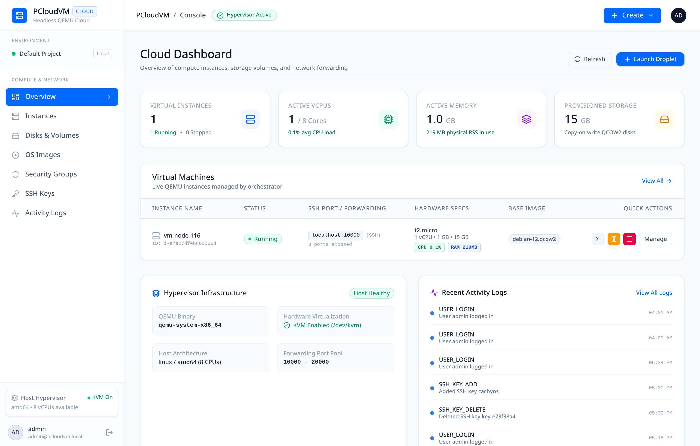

</div>

---

> [!NOTE]
> **Educational Project Disclaimer:**  
> PCloudVM was created for learning and experimentation purposes to understand how cloud platforms (like DigitalOcean and AWS EC2) manage headless virtual machines, virtual disk layering, user-mode networking, and host telemetry using pure Go and Linux KVM. It is designed as an accessible reference implementation rather than an enterprise production cloud.

---

## 📖 Table of Contents

- [About the Project](#-about-the-project)
- [Key Features](#-key-features)
- [Visual Tour](#-visual-tour)
- [How It Works](#-how-it-works)
  - [Architecture Overview](#architecture-overview)
  - [Copy-on-Write Storage](#copy-on-write-storage)
  - [Dynamic Port Forwarding via QMP](#dynamic-port-forwarding-via-qmp)
  - [Telemetry & Resource Sampling](#telemetry--resource-sampling)
- [Project Structure](#-project-structure)
- [Quickstart Guide](#-quickstart-guide)
  - [Prerequisites](#prerequisites)
  - [1. Setup Backend](#1-setup-backend)
  - [2. Setup Dashboard](#2-setup-dashboard)
- [CLI Reference](#-cli-reference)
- [API Reference](#-api-reference)
- [License](#-license)

---

## 💡 About the Project

When using modern cloud platforms, provisioning a virtual server feels instantaneous. Under the hood, this involves complex coordination between Linux kernel virtualization (KVM), hardware emulation processes (QEMU), block storage layering, virtual networking, and guest initialization.

PCloudVM implements these fundamental cloud concepts in a clean, approachable codebase:
1. **Core Hypervisor Daemon (Go)**: Directly controls QEMU processes using KVM hardware acceleration and communicates via the QEMU Machine Protocol (QMP) over UNIX sockets.
2. **Cloud Web Console (Next.js 16)**: A modern, responsive dashboard inspired by DigitalOcean's clean interface, complete with an in-browser SSH terminal, security groups editor, and real-time resource meters.

---

## ✨ Key Features

- **EC2-style Virtual Machine Sizing**: Pre-configured tiers (`t2.nano`, `t2.micro`, `t2.small`, `t2.medium`, `c5.large`, `m5.large`) or custom vCPU, RAM, and storage settings.
- **KVM Hardware Acceleration**: Runs headless VMs with native Linux KVM (`/dev/kvm`) acceleration for near-native CPU and memory performance.
- **Sub-Second Storage Provisioning**: Uses QCOW2 Copy-on-Write (CoW) overlays referencing golden base OS images (Debian 12, Ubuntu 24.04, Alpine, CirrOS), enabling instant VM creation without duplicating disk space.
- **Dynamic Port Management & Security Groups**: Expose and route host ports (`10000–20000`) to guest services (SSH 22, HTTP 80, HTTPS 443, etc.). Inbound rules can be hot-added or removed on running VMs via QMP.
- **Cloud-Init Automated Bootstrapping**: Generates custom NoCloud `cidata` seed ISOs to configure users, inject public SSH keys, and run initial setup scripts automatically upon boot.
- **In-Browser Interactive Web Shell**: A built-in terminal bridge that lets you access your VM shell directly from the browser with full ANSI color support and quick diagnostic actions.
- **Real-Time Telemetry**: Dual-layer metrics tracking physical host memory footprint (RSS) alongside guest `/proc/meminfo` and CPU delta jiffies matching `htop` inside the VM.
- **Built-in Auth & Audit Logging**: User authentication stored in SQLite (WAL mode) with password hashing and an activity trail of all provisioning actions.

---

## 📸 Visual Tour

### 1. Cloud Dashboard Overview
Central hub showing overall compute resources, active vCPUs, memory usage, storage allocation, and running virtual droplets.


---

### 2. Live Telemetry & Resource Monitoring
Real-time gauges for CPU utilization, guest memory usage (matching `htop`), host RSS footprint, and system uptime.
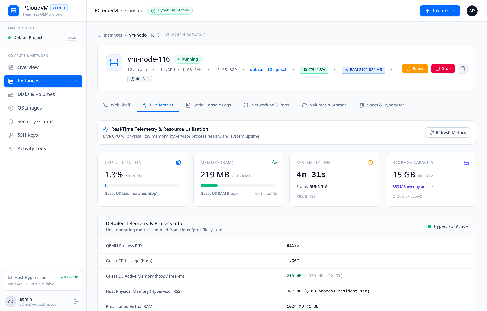

---

### 3. In-Browser Web Shell
Execute commands, inspect logs, and run diagnostics (like `fastfetch` or `uname`) directly through the browser without needing an external terminal.
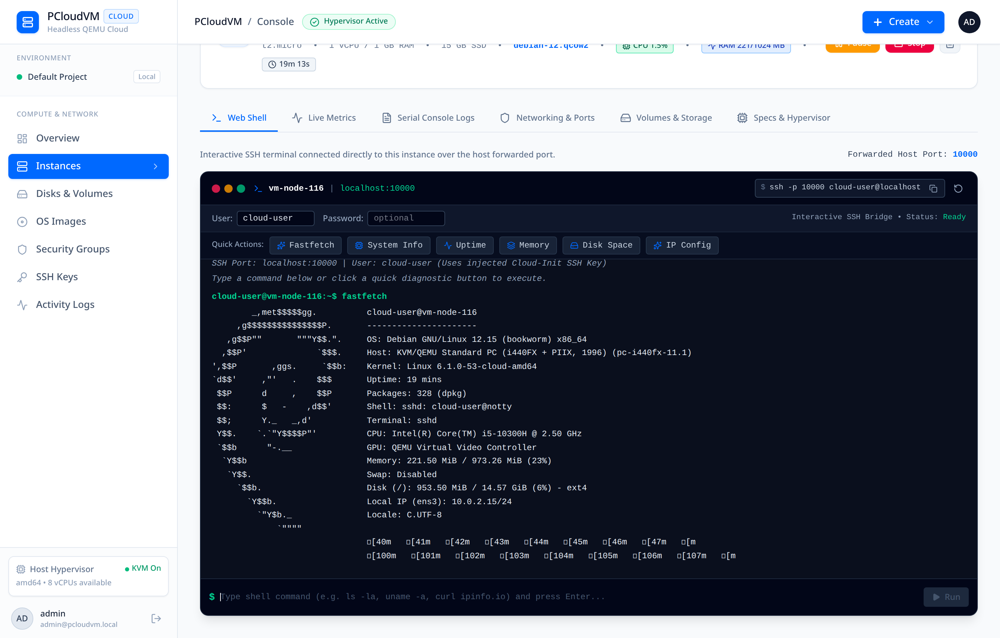

---

### 4. Droplet Provisioning Flow
Select an operating system image, choose instance hardware specs, and bind firewall security groups.
| Droplet Creation Modal | Instances List Table |
|:---:|:---:|
| 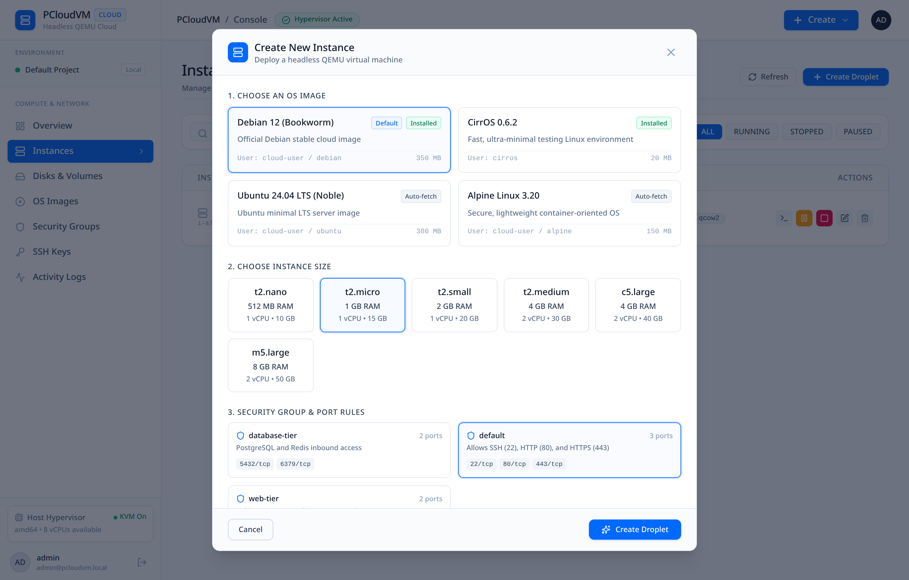 | 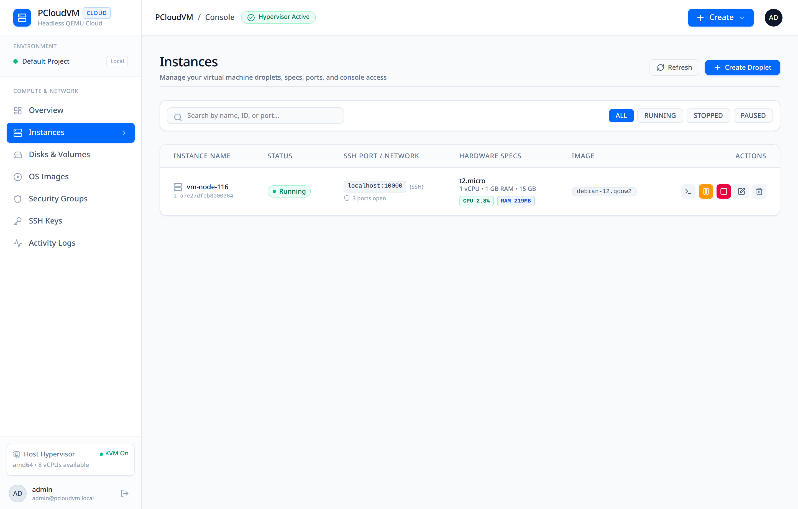 |

---

### 5. Networking & Security Groups
Configure port forwarding rules and manage firewall security groups for web, database, or custom services.
| Port Forwarding Mappings | Security Groups Editor |
|:---:|:---:|
| 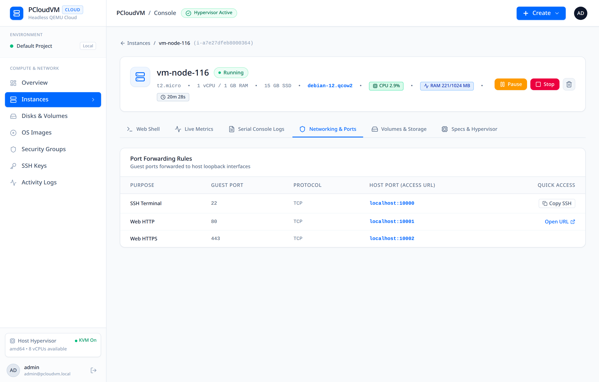 | 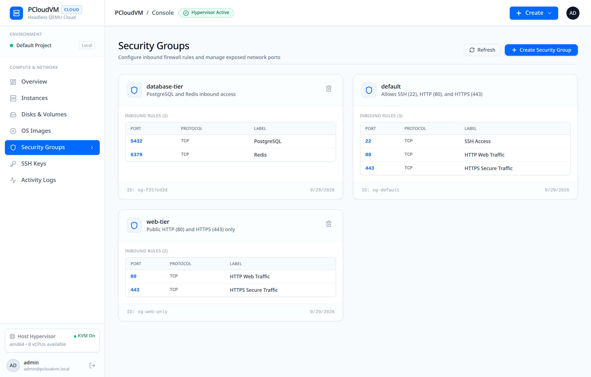 |

---

### 6. Storage & Cloud OS Images
Inspect Copy-on-Write disk overlays and manage golden OS cloud images.
| Disks & Volumes | Cloud OS Images Catalog |
|:---:|:---:|
| 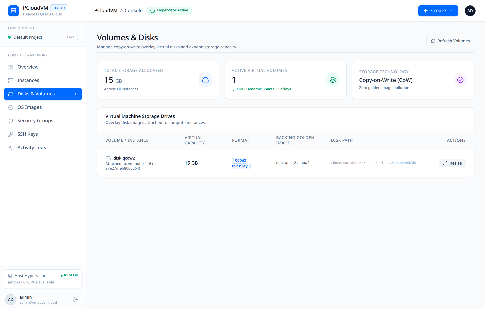 | 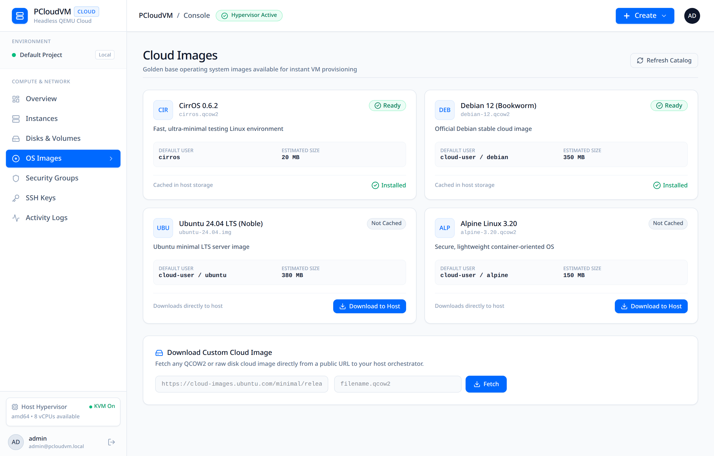 |

---

### 7. SSH Key Vault & Activity Logs
Store public SSH keys for automatic cloud-init injection and view operational audit logs.
| SSH Key Management | Activity & Audit Logs |
|:---:|:---:|
| 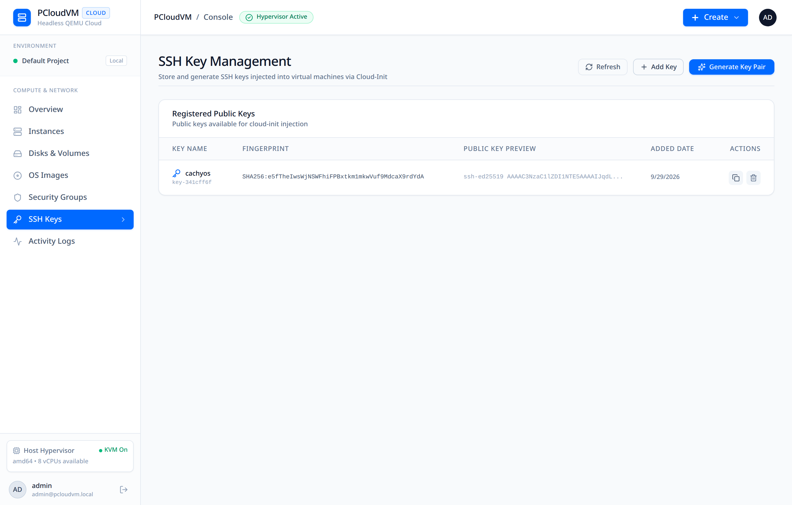 | 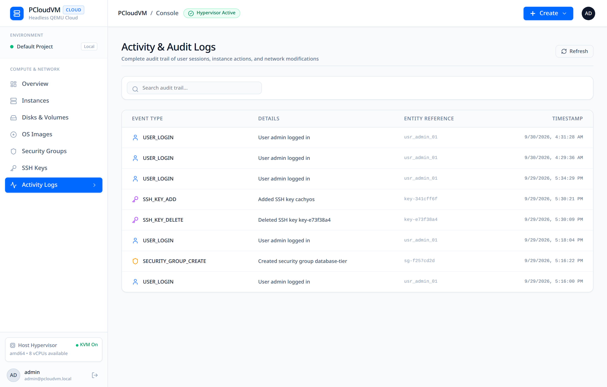 |

---

## 🛠️ How It Works

### Architecture Overview

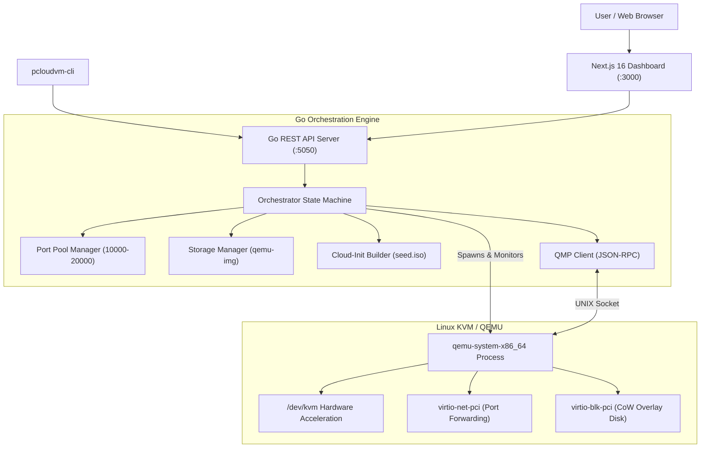

### Copy-on-Write Storage
Instead of copying a full multi-gigabyte OS image for each new VM:
1. PCloudVM keeps base cloud images (`debian-12.qcow2`, `ubuntu-24.04.img`) as read-only **backing files**.
2. When launching an instance, it creates a lightweight QCOW2 overlay disk:
   ```bash
   qemu-img create -f qcow2 -b /path/to/base.qcow2 -F qcow2 /instance/disk.qcow2 15G
   ```
3. The instance only writes changes (modified blocks) to the overlay, keeping creation time under a fraction of a second and saving host storage.

### Dynamic Port Forwarding via QMP
VMs run behind QEMU's user-mode network stack (`slirp`). To allow external access, the orchestrator assigns a unique host port for each guest port (e.g. host `10000` -> guest `22`).

When updating ports while the VM is running, PCloudVM sends commands through the QEMU Machine Protocol (QMP) UNIX socket:
```json
{
  "execute": "human-monitor-command",
  "arguments": {
    "command-line": "hostfwd_add net0 tcp:127.0.0.1:10001-:80"
  }
}
```
This updates the port forwarding table immediately without having to stop or reboot the virtual machine.

### Telemetry & Resource Sampling
- **Host RSS Memory**: Read directly from the Linux `/proc/<pid>/statm` file of the running QEMU process.
- **Guest CPU & RAM**: Sampled by reading `/proc/meminfo` and calculating delta CPU jiffies from `/proc/stat` over the local connection. This provides exact alignment with what `htop` displays inside the VM.

---

## 📁 Project Structure

```
PCloudVM/
├── backend/                       # Go Orchestrator Core
│   ├── cmd/
│   │   ├── cli/                   # pcloudvm-cli Terminal Client
│   │   └── server/                # HTTP REST API Server
│   ├── internal/
│   │   ├── api/                   # REST Endpoints and Routing
│   │   ├── cloudinit/             # ISO9660 cidata Seed Generator
│   │   ├── config/                # Port Pools and Config Defaults
│   │   ├── model/                 # Data Structures and Specs
│   │   ├── network/               # Port Bitmap Allocator
│   │   ├── orchestrator/          # State Machine & Telemetry Logic
│   │   ├── qemu/                  # QEMU Flags Builder & QMP Client
│   │   ├── storage/               # QCOW2 Overlay Manager
│   │   └── store/                 # Thread-safe Instance Storage
│   └── tests/                     # Unit and E2E Lifecycle Tests
├── dashboard/                     # Next.js 16 Web Dashboard
│   ├── src/
│   │   ├── app/
│   │   │   ├── (dashboard)/       # Console Pages (Overview, Droplets, Disks, etc.)
│   │   │   ├── login/             # Login Screen
│   │   │   └── api/               # Dashboard Auth & SSH Bridge Routes
│   │   ├── components/            # UI Components (WebTerminal, Modals, Cards)
│   │   └── lib/                   # Database (SQLite) & Auth Helpers
│   └── scripts/                   # Automated Screenshot Capture Script
├── docs/
│   └── screenshots/               # High-Resolution Dashboard Screenshots
└── README.md                      # Project Documentation
```

---

## 🚀 Quickstart Guide

### Prerequisites
- **Linux Machine** (Ubuntu, Debian, Fedora, Arch Linux, etc.)
- **KVM Enabled**:
  ```bash
  # Check if KVM is available
  ls -l /dev/kvm
  # Ensure your user has access
  sudo usermod -aG kvm $USER
  ```
- **System Utilities**: `qemu-system-x86_64`, `qemu-img`, `xorriso`, `curl`, `git`
- **Development Tools**: Go 1.22+ and Node.js 20+ (with `pnpm`)

---

### 1. Setup Backend

```bash
# Clone the repository
git clone https://github.com/Saurabh254/PCloudVM.git
cd PCloudVM/backend

# (Optional) Download a base cloud image
mkdir -p data/images
curl -L -o data/images/debian-12.qcow2 \
  https://cloud.debian.org/images/cloud/bookworm/latest/debian-12-genericcloud-amd64.qcow2

# Run tests to verify hypervisor support
go test -v ./...

# Build server and CLI
go build -o bin/pcloudvm-server cmd/server/main.go
go build -o bin/pcloudvm-cli cmd/cli/main.go

# Start the orchestrator (Listens on http://localhost:5050)
./bin/pcloudvm-server
```

---

### 2. Setup Dashboard

Open a separate terminal:

```bash
cd PCloudVM/dashboard

# Install dependencies
pnpm install

# Start development server
pnpm dev
```

Open your browser at **`http://localhost:3000`**.

> **Default Demo Login:**
> - **Username**: `admin`
> - **Password**: `password123`

---

## 💻 CLI Reference

You can manage virtual machines directly from the command line using `pcloudvm-cli`:

```bash
# View host virtualization info
./bin/pcloudvm-cli info

# List available instance sizing tiers
./bin/pcloudvm-cli types

# Launch a new virtual machine
./bin/pcloudvm-cli launch \
  --name "demo-node" \
  --type "t2.micro" \
  --ports "22,80,443" \
  --ssh-key "$(cat ~/.ssh/id_ed25519.pub)"

# List all instances and their forwarded ports
./bin/pcloudvm-cli list

# Pause / Resume a running instance
./bin/pcloudvm-cli pause <instance-id>
./bin/pcloudvm-cli resume <instance-id>

# Hot-edit firewall ports while the instance is running
./bin/pcloudvm-cli edit <instance-id> --ports "22,80,443,8080"

# View serial boot logs
./bin/pcloudvm-cli logs <instance-id>

# Stop or terminate an instance
./bin/pcloudvm-cli stop <instance-id>
./bin/pcloudvm-cli terminate <instance-id>
```

---

## 🌐 API Reference

The Go orchestrator provides a straightforward REST API on port `5050`:

| Method | Endpoint | Description |
|:---|:---|:---|
| `GET` | `/healthz` | Health check endpoint |
| `GET` | `/api/v1/system/info` | Host CPU, KVM status, and port pool info |
| `GET` | `/api/v1/instance-types` | List available instance hardware types |
| `GET` | `/api/v1/images` | List available base images |
| `GET` | `/api/v1/instances` | List all provisioned instances |
| `POST` | `/api/v1/instances` | Create and launch a new instance |
| `GET` | `/api/v1/instances/{id}` | Get instance details and allocated ports |
| `GET` | `/api/v1/instances/{id}/status` | Check live QMP execution status |
| `GET` | `/api/v1/instances/{id}/metrics` | Sample CPU and memory metrics |
| `POST` | `/api/v1/instances/{id}/start` | Start a stopped instance |
| `POST` | `/api/v1/instances/{id}/stop` | Graceful ACPI powerdown via QMP |
| `POST` | `/api/v1/instances/{id}/pause` | Pause CPU execution |
| `POST` | `/api/v1/instances/{id}/resume` | Resume CPU execution |
| `PATCH` | `/api/v1/instances/{id}` | Edit ports (live) or resize specs (when stopped) |
| `DELETE` | `/api/v1/instances/{id}` | Terminate instance and delete disks |
| `GET` | `/api/v1/instances/{id}/logs` | Stream serial console output |

---

## 📜 License

This project is licensed under the **MIT License** — feel free to use it for learning, teaching, or building your own projects.
